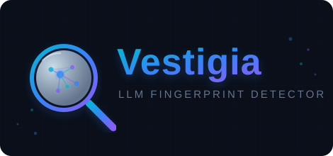

<p align="center">
  
</p>

# Vestigia

Vestigia is a Python toolkit for building and comparing **behavioral fingerprints** of large language models (LLMs). It repeatedly submits fixed probes, extracts a stable feature from each response, and compares the resulting empirical distributions.

## Purpose

A model fingerprint is not a model name or one response. It is an observed output distribution under a controlled experiment:

- a fixed prompt and system instruction;
- fixed generation and endpoint settings;
- a probe-specific parser and feature field;
- repeated, independently collected responses.

This makes it possible to measure behavioral similarity between an unknown model response set and a library of previously collected model fingerprints.

## Typical applications

- **Model provenance research** — assess which reference model an externally collected response distribution most resembles.
- **Gateway and deployment verification** — detect whether a routed endpoint appears to behave consistently with an expected reference deployment.
- **Model regression monitoring** — track behavioral distribution changes after model, gateway, or serving-stack updates.
- **LLM evaluation research** — compare response tendencies using controlled probes rather than a single anecdotal completion.

Vestigia supports OpenAI-compatible and Anthropic-style endpoints through LiteLLM. It includes fixed probes such as favorite-number selection and project-success scoring, plus utilities for collection, stability analysis, persistence, and offline distribution prediction.

## Documentation

- [Usage guide (English)](doc/usage_en.md)
- [使用说明（中文）](doc/usage_cn.md)
- [项目简介（中文）](doc/README_cn.md)

## Development

```bash
python -m pip install -e ".[dev]"
python -m pytest
```

Never commit API keys or real endpoint credentials to source control.
